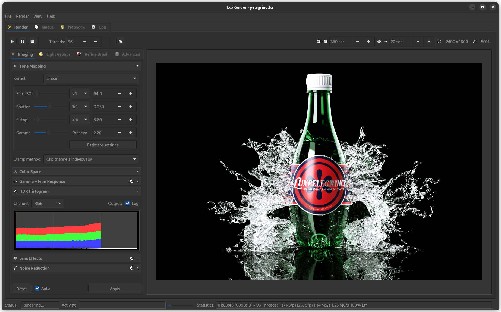
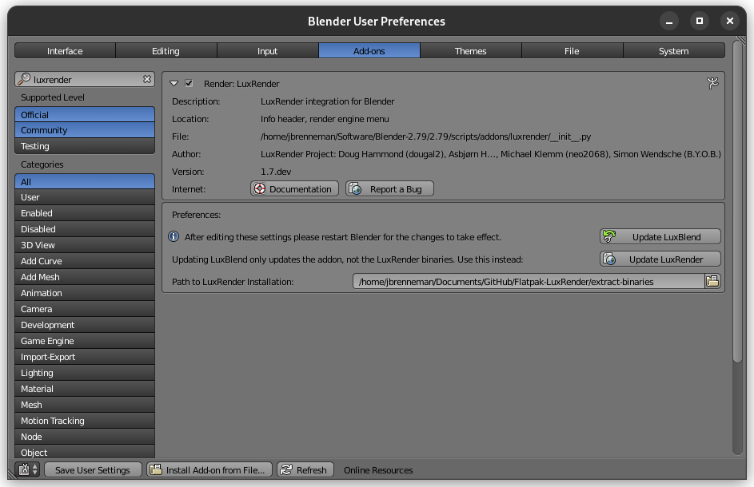
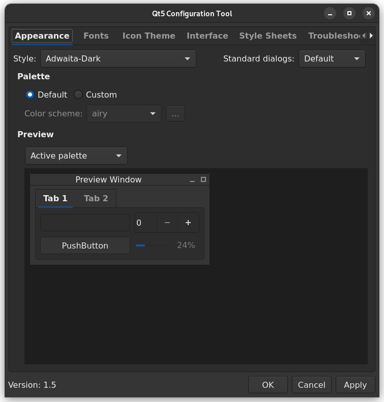

# LuxRender 1.7 Flatpak


This repository provides the sources for building the LuxRender 1.7 Flatpak package.


## Building the Flatpak

This script requires the zlib, bzip2, lzma, jpeg, tiff, png, freetype, and fftw development packages to be installed from your distribution's package manager.

```sh
apt install zlib bzip2 lzma libjpeg-dev libtiff-dev libpng-dev libfreetype-dev libfftw3-dev
```


Install the Flatpak utilities from your distribution's package manager.

```sh
apt install flatpak flatpak-builder
```


Add the Flathub repository to enable retrieval of certain dependencies.

```sh
flatpak remote-add --user --if-not-exists \
	flathub https://flathub.org/repo/flathub.flatpakrepo
```


Clone this GitHub repository.

```sh
git clone --recursive https://github.com/rrubberr/Flatpak-LuxRender && cd Flatpak-LuxRender
```


Finally, build the LuxRender 1.7 package using Flatpak Builder.

```sh
flatpak-builder --install --install-deps-from=flathub \
	--user --force-clean \
	.build-dir org.luxrender.luxrender17.yml
```


## Running the Flatpak

After the package has been compiled, LuxRender can be launched using the follwing command.

```sh
flatpak run org.luxrender.luxrender17
```


## Creating Binaries for Blender

In order to use LuxRender with Blender and LuxBlend25, certain binaries and shared libraries must be extracted from the Flatpak installation.

From the Flatpak-LuxRender directory, run the following command.

```sh
sh extract-binaries/extract-binaries.sh
```

This will populate the extract-binaries folder with everything needed to run LuxRender outside of Flatpak.

After installing the LuxBlend25 addon, point LuxBlend25 to the extract-binaries directory in order to enable Blender interoperability.



## Setting a Qt5 Theme

Install the Qt5 Configuration Tool.

```
sudo apt install qt5ct
```

Set the system Qt5 theme to "Adwaita-Dark" as shown in the included screenshot. Adjust the font size to your taste.




## Known limitations

LuxBlend25's LuxCore features may not function.
