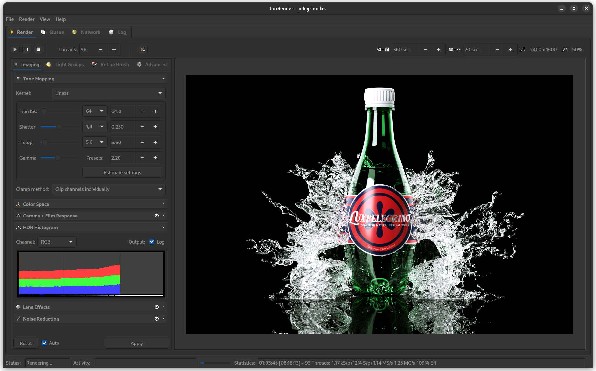
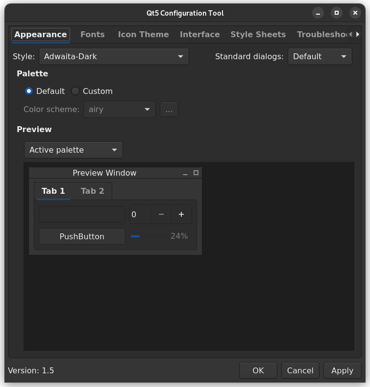

# LuxRender Flatpak


This repository provides the sources for building the LuxRender Flatpak package.


# Getting Started

Once you have compiled the system, check the [Wiki page](https://github.com/rrubberr/Flatpak-LuxRender/wiki) for in-depth information.

Install the updated version of [LuxBlend25](https://github.com/rrubberr/Flatpak-LuxBlend25) for Blender 2.79 integration.

Download and try a [test scene.](https://github.com/rrubberr/Flatpak-LuxRender-Scenes)


## Dependencies

Building LuxRender requires the Flatpak, Flatpak builder, bzip2, lzma, jpeg, tiff, png, freetype, fftw, and Qt5 core, gui, widgets, and image formats packages.

On a Debian based distribution:

```sh
sudo apt install flatpak flatpak-builder bzip2 lzma libjpeg-dev libopenjp2-dev libtiff-dev libpng-dev libfreetype-dev libfftw3-dev libqt5core5 libqt5gui5 libqt5widgets5 qt5-image-formats-plugins
```

On a Fedora based distribution:

```sh
sudo dnf install flatpak flatpak-builder bzip2 lzma libjpeg-devel openjpeg-devel libtiff-devel libpng-devel freetype-devel fftw-devel qt5-qtbase-devel qt5-qtimageformats
```

Add the Flathub repository to enable retrieval of Flatpak dependencies.

```sh
flatpak remote-add --user --if-not-exists \
	flathub https://flathub.org/repo/flathub.flatpakrepo
```


## Building the Flatpak

Clone this GitHub repository.

```sh
git clone --recursive https://github.com/rrubberr/Flatpak-LuxRender && cd Flatpak-LuxRender
```

Build the LuxRender package using Flatpak Builder.

```sh
flatpak-builder --install --install-deps-from=flathub --user --force-clean .build-dir org.luxrender.luxrenderui.yml
```


## Running the Flatpak

After the package has been compiled, LuxRender can be launched using the following command.

```sh
flatpak run org.luxrender.luxrenderui
```



## Creating Binaries for Blender

In order to use LuxRender with Blender and [LuxBlend25](https://github.com/rrubberr/Flatpak-LuxBlend25), the compiled binaries and shared libraries must be extracted from the Flatpak installation.

From the Flatpak-LuxRender directory, run the following command.

```sh
sh extract-binaries/extract-binaries.sh
```

This will populate the extract-binaries folder with everything needed to run LuxRender outside of Flatpak. The user can now move this folder anywhere he desires.

After installing [LuxBlend25](https://github.com/rrubberr/Flatpak-LuxBlend25), point the addon to the previously created directory in order to enable Blender interoperability.


## Setting a Qt5 Theme

Your system will likely apply an incorrect theme to LuxRender. To remedy this, install the Qt5 Configuration Tool and adwaita-qt.

On a Debian based distribution:

```sh
sudo apt install qt5ct adwaita-qt
```

On a Fedora based distribution:

```sh
sudo dnf install qt5ct adwaita-qt5
```

Set the system Qt5 theme to "Adwaita-Dark" as shown in the included screenshot. Adjust the typeface and size to your taste in the "Fonts" tab.




## New Features

### LuxRays

* New FlatPak build system with GCC 12 support.

### LuxRender

* New FlatPak build system with GCC 12 support.
* New QT5 based GUI with dark mode and theme support.
* Added the ability to select more than 32 threads in the GUI.
* Added a fifth decimal place to certain post-process effects for finer tuning.
* Removed support for LuxCoreRender rendering engines. If LuxCoreRender features are desired, such as pure OpenCL path tracing, users are reccomended to consult the [LuxCoreRender project page.](https://github.com/LuxCoreRender)

### LuxBlend

* Added the ability to set the mesh accelerator (QBVH, KDTree, etc.) per-mesh in the Blender mesh data panel.
* Added the Hybrid Bidirectional integrator for OpenCL-accelerated bidirectional path tracing.
* Added the IGI (Instant Global Illumination) accelerator.
* Added the ERPT (Energy Redistribution Path Tracing) sampler and associated settings. This is experimental and often generates poor results.
* Added the Mutation Range setting for the Metropolis Sampler.
* Added additional accelerators including BVH/Octree and the ability to use no accelerator.
* Removed support for LuxCoreRender rendering engines. If LuxCoreRender features are desired, such as pure OpenCL path tracing, users are reccomended to consult the [LuxCoreRender project page.](https://github.com/LuxCoreRender)

## Known limitations

The LuxRender Flatpak is intended for use with modern Linux systems, and has been confirmed to build on a wide variety of current distributions from Debian 12, to Fedora 39, to Clear Linux version 40000+.

Support for Windows and MacOS is not planned.

On older Linux systems, Mac OSX, and Windows, users are reccomended to use [LuxRender 1.6 binaries.](https://wiki.luxcorerender.org/Previous_Version)
