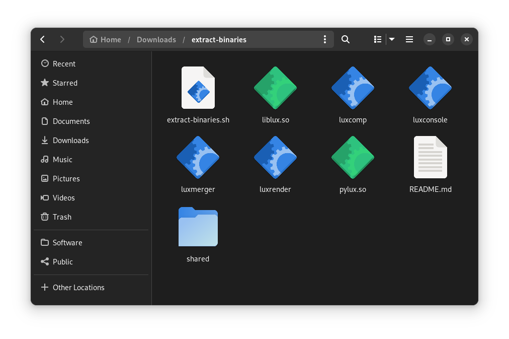

# extract-binaries.sh



This script extracts LuxRender and its supporting shared objects from the Flatpak install, after it has been built.


## Using the Scripts

```
sh extract-binaries.sh
```


## Setting a Qt5 Theme

Your system will likely apply an incorrect theme to LuxRender. To remedy this, install the Qt5 Configuration Tool and adwaita-qt.

On a Debian based distribution:

```sh
sudo apt install qt5ct adwaita-qt
```

On a Fedora based distribution:

```sh
sudo dnf install qt5ct adwaita-qt5
```

Set the system Qt5 theme to "Adwaita-Dark" as shown in the included screenshot. Adjust the typeface and size to your taste in the "Fonts" tab.


