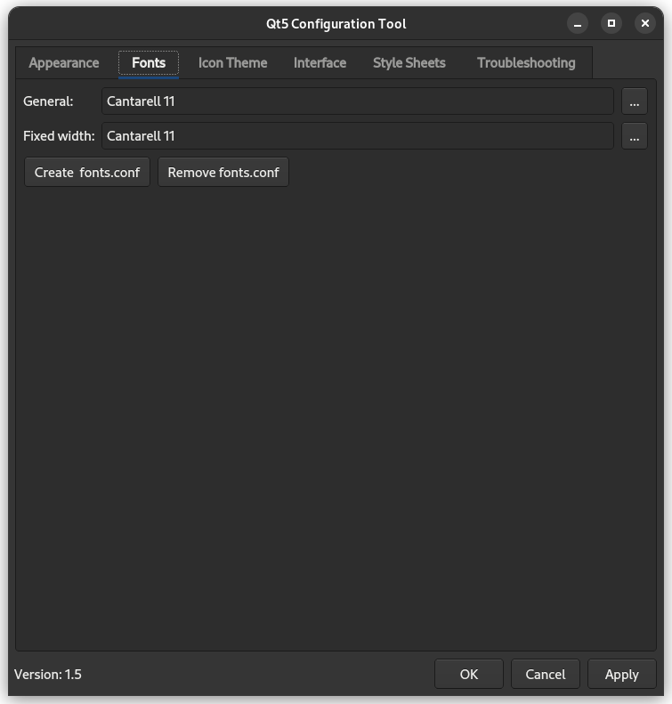

# extract_from_flatpak.sh

This script extracts LuxRender and its supporting shared objects from the Flatpak install, after it has been built.

Be sure to run LuxRender from the included 'run_LuxRender.sh' to apply your system Qt5 theme.


## Using the Scripts

```
sh extract_from_flatpak.sh
```

```
sh run_LuxRender.sh
```


## Setting a Qt5 Theme

Install the Qt5 Configuration Tool.

```
sudo apt install qt5ct
```

Set the system Qt5 theme to "Adwaita-Dark" as shown in the included screenshot. Adjust the font size to your tastes.


